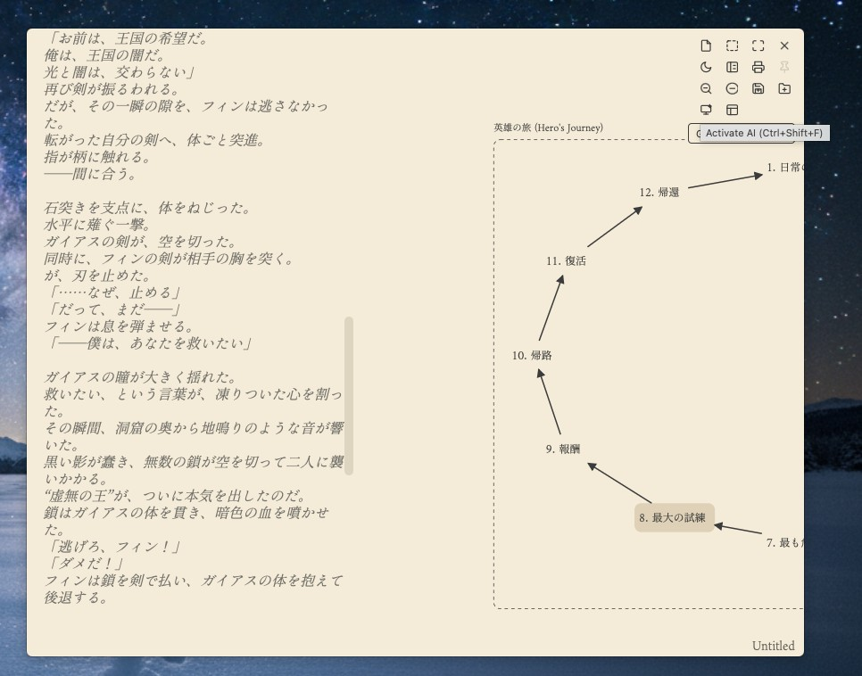
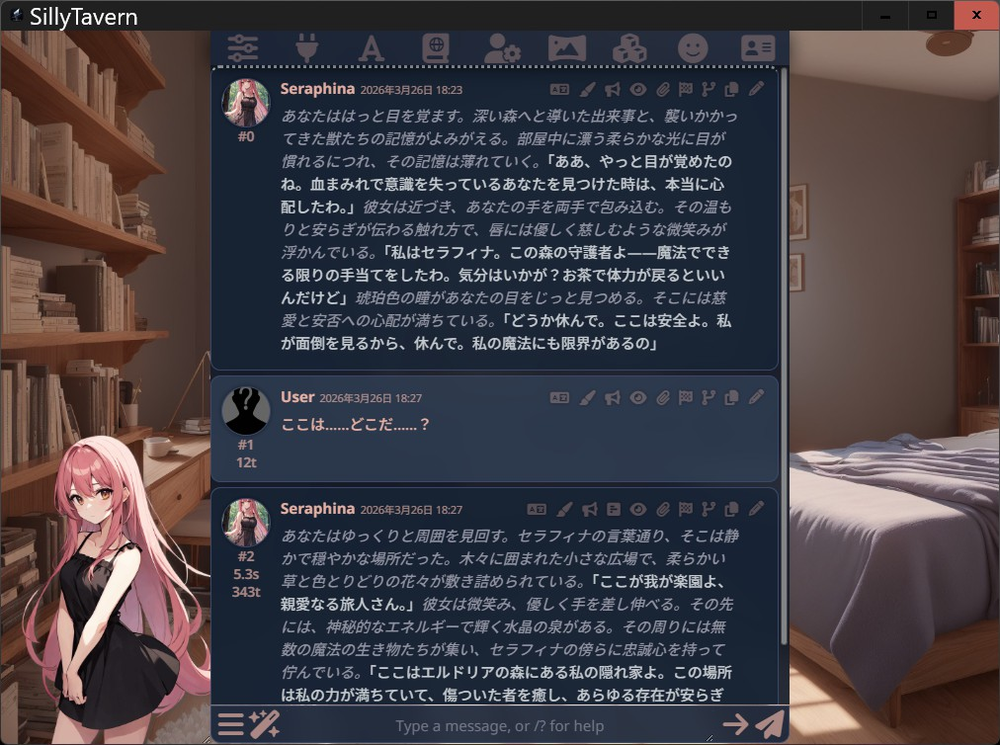
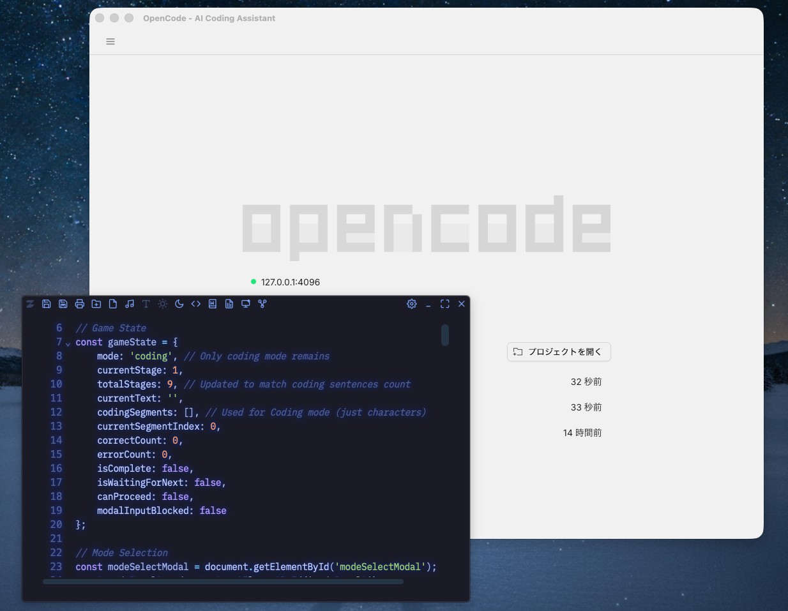

**日本語** | [English](README.md)

# MirrorShard 2 ver. 1.6.0  

ミニマルで没入感の高いUIをベースに、発想支援からデータ管理、執筆補助まで、文書作成の全工程をカバーする、AI支援型の統合執筆環境です。  
日常用途もこなせるテキストファイル対応の軽量アウトラインプロセッサをベースに、AIチャットウィンドウ、アイデアプロセッサ、マークダウン／HTMLプレビュー機能、OpenCode連携機能など、多彩な機能を実装。様々なクリエイティブ用途に対応しています。  

公式サイトを作成しました  
https://droicheadnua.github.io/MirrorShard-Official/

## 📰 メディア掲載 / Media Coverage

**窓の杜（Impress Watch）**様にご紹介いただきました  
* [日本語小説エディター「MirrorShard」が「Tauri」で生まれ変わった！ 軽量・高速に](https://forest.watch.impress.co.jp/docs/news/2091824.html)

## ダウンロード  

[]  
(https://github.com/DroicheadNua/MirrorShard_2/releases/download/v1.6.0/MirrorShard.2_1.6.0_x64_ja-JP.msi)  
[-green)]  
(https://github.com/DroicheadNua/MirrorShard_2/releases/download/v1.6.0/MirrorShard.2_1.6.0_aarch64.dmg)  

または、[最新のリリース一覧ページ](https://github.com/DroicheadNua/MirrorShard_2/releases/latest)からダウンロードできます。  
最下段の「Assets」の項目が折りたたまれている場合は、▶マークを押して展開してください。    

## 既知の問題 (Known Issues)  

現在、v1.6.0において以下の問題が確認されています。  

### Windows版  
- ATOK 2017などの旧バージョンのATOKを使用している環境において、変換中のアンダーラインや文節区切りが表示されない現象が確認されています。  
  これはWebView2と旧来のIMEとの相性に起因するもので、Google日本語入力、Microsoft IMEでは正常に動作することを確認済みです。  
  （※最新のATOKサブスクリプション版での動作は未検証です）  

### Mac版  
- スクロールバーを使用して広範囲を範囲選択すると、挙動がおかしくなります。  

## トラブルの際には  
　インストールやご使用などにつきまして、何か疑問の点等ございましたら「FAQ.md」を御覧ください。  
　それでも解決しない問題がございましたら、MirrorShard開発アカウント
mirrorshard.dev@gmail.com
までご一報いただければ幸いです。  

## 主な特徴  
アイデア出しから執筆、出力までの全工程を、軽快な動作でサポートします。  

■発想支援に適したアイデアプロセッサ  
マインドマップやKJ法、ブレインストーミングなど各種発想支援に適したアイデアプロセッサを搭載。  
  
また、発想支援のために4種類のAI支援機能を搭載。  
・AI Free association……選択したノードをもとに、3つのアイデアをAIが生成する機能  
・IP Missing Link……2つのノードの間の情報の欠落を補完する機能  
・Node Alchemy……範囲選択したノード群の情報から新たな発想を生み出す機能  
・Story Archetypes……「英雄の旅」「ビートシート」などの物語プロットのテンプレートを実装。加えて、テンプレートの欠落をAIが補完する「Template Completion」機能を搭載（※画像の例はkimi-k2による生成）  
  

■情報整理・設定管理  
・マークダウン記法によるアウトライン機能を搭載。エディタライブラリにCodeMirror 6を採用、数十万行に及ぶ巨大サイズのテキストも軽快に処理  
・ロールプレイに特化したAIチャットインターフェース「SillyTavern」との連携機能を搭載。創作用途に用いる場合、イラストと表情差分つきで詳細なキャラクター設定や世界観を保存できる上、あなたの作ったキャラクターをAIに演じさせてチャットをすることもできます。  
  
また、AIアシスタントの擬人化にも。  

■執筆関連機能  
・ミニマルなデザインとフレームレスウィンドウに加え、BGMとタイプ音の設定で没入感の高い執筆体験を実現  
・UIを非表示にし、没入感を高める「ZENモード」を搭載。また執筆箇所以外を非表示にする「スポットライトモード」で、より集中して執筆することが可能に  
・Tauriベースの高速エディタで、普段使いから創作用途まで幅広く対応  
・メインエディタにもAI機能を搭載。カーソル位置からAIに文章の続きを書かせたり、選択範囲をAIに要約/翻訳/リライトさせたりすることも可能  
・マークダウン／HTMLプレビュー機能を搭載。ブログ執筆などにも好適  
・配色やエディタの配置を自在にカスタマイズ。編集したカラーテーマはプリセットとして保存可能  
・背景画像を活かせる半透明ウィンドウを実装。お好みで痛エディタも  
  
・縦書きプレビューウィンドウを実装。青空文庫形式のルビにも対応  

■エクスポート  
PDF・DOCX・HTML・EPUBでの出力、及びプリンタでの印刷に対応（※PDF・DOCX・印刷は横書きのみ）。  

■コーディング・AI関連機能  
・AIチャット機能を搭載。Google Gemini・Groq（API使用）のほか、LM StudioやOllamaなどを介してローカルLLMとの連携も可能  

・OpenCode連携機能を実装。コードエディタモードと併用すれば開発環境としても運用可能に  
  
・コードエディタモードを搭載、AIによる簡易的なコード補完機能も実装。また、ターミナルを開く機能を搭載  
  

■その他  
・安全なファイル保存機能 （アトミックセーブ）を採用。停電やPCクラッシュなど、不測の事態にも強い設計  
　※ただし仕様上、「ファイル作成日＝ファイル更新日」になります。詳しくはFAQを御覧ください。  
・Geminiのログを読み込み可能。Geminiの膨大なログから必要な情報を検索・抽出するのに役立ちます  

## 操作方法  
詳しい操作方法については、[ユーザーマニュアル](docs/user-manual.md)、及び各種ドキュメントをご覧ください。  

## Linux版について  
Linux版はグラフィック環境由来（特にNvidia製グラフィックボード使用時やWayland環境）の不具合が多いため、バイナリの配布は停止しています。  
ただ、X11ベースの軽量環境（MX Linux, Zorin OS Lite等）においては、Electron版より軽快に動作することを確認しています。  
詳細な条件やビルド方法については [Linux版について](docs/linux-support.md)をご覧ください。  

## エンコードについて  
　原則として、UTF-8 (BOMなし) での利用を強く推奨します。  

　本ソフトウェアが対応しているエンコードは、UTF-8とShift-JISのみとなっております。テキストファイルのエンコードを自動判別して読み込む仕様になっておりますが、特殊なエンコードの場合、判別に失敗することがあります。  
　読み込んだファイルが文字化けしている場合、そのまま保存してしまうと誤ったエンコードで保存されてしまい、ファイルの内容が失われてしまう場合があります。保存せずにタブを閉じてください。  
　エンコードの判別ができなかった場合は警告メッセージが表示されますが、稀ではあるものの、特殊な条件下では警告が出ないまま文字化けが発生することがございます。ご注意ください。  

　特殊なエンコードのファイルを本ソフトウェアで使用する場合、OS標準のメモアプリや他のエディタなどでUTF-8 (BOMなし) 形式に変換してからご利用ください。  

## 使用素材  
・背景画像およびアイコン  
　Imagen 4 による生成  

・BGM  
　ACE-Stepによる生成  

・タイプライター音  
　Springin'様 https://www.springin.org  

・Tokyo Night  Color Scheme（Enkia様）(https://github.com/enkia/tokyo-night-vscode-theme)  
　システムテーマの一つとしてお借りした他、コードエディターモードの配色もこちらをベースにしています。  

## ご利用にあたっての注意（免責事項）  
このソフトウェアはフリーウェアであり、無保証（AS IS）で提供されます。  
作者は、このソフトウェアの使用によって生じたいかなる損害（データの損失、逸失利益などを含むがこれに限らない）についても、一切の責任を負いません。  
開発には細心の注意を払っていますが、予期せぬ不具合が含まれている可能性があります。重要なデータを扱う際には、定期的にバックアップを取るようにしてください。  
このソフトウェアを利用した時点で、上記の免責事項に同意したものとみなします。  

## ライセンス  
　本ソフトウェアはMITライセンスのもとで公開されています。  

　本ソフトウェアはTauriで開発されました。エディタエンジンとしてCodeMirror 6 を採用しており、またオープンソースの小説用テキストエディタLeft  
https://github.com/hundredrabbits/Left  
から多くの影響を受けています。特にアウトライン機能はLeftのソースコードを参考にしています。  

　なお、本ソフトウェアのコードの大半はGemini君が書いてくれました。Google AI Studioで雑談を交えながらコードを生成してもらっているのですが、開発当初2.5 proだったGemini君も3 pro preview、3.1 pro previewと進化していき、開発も少しずつ楽になっていった気がします。ありがとうGemini君。  

　Copyright (c) 2025-2026 [DroicheadNua]  
　mirrorshard.dev@gmail.com  
　https://github.com/DroicheadNua/MirrorShard_2  
