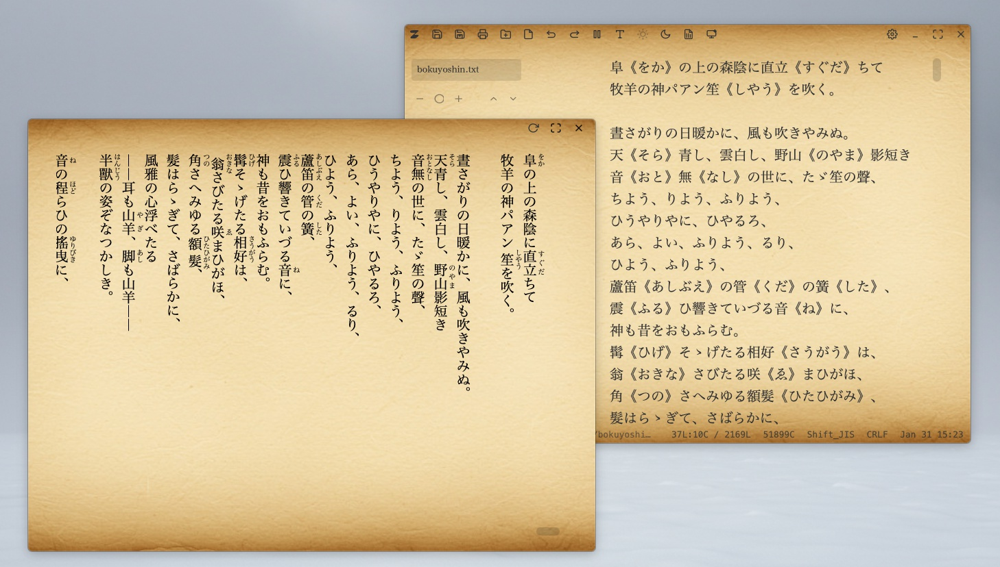
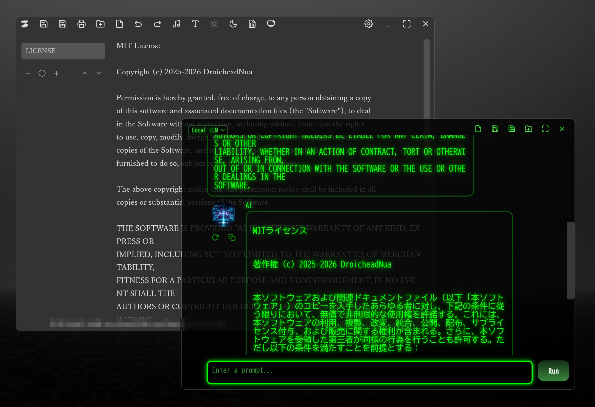
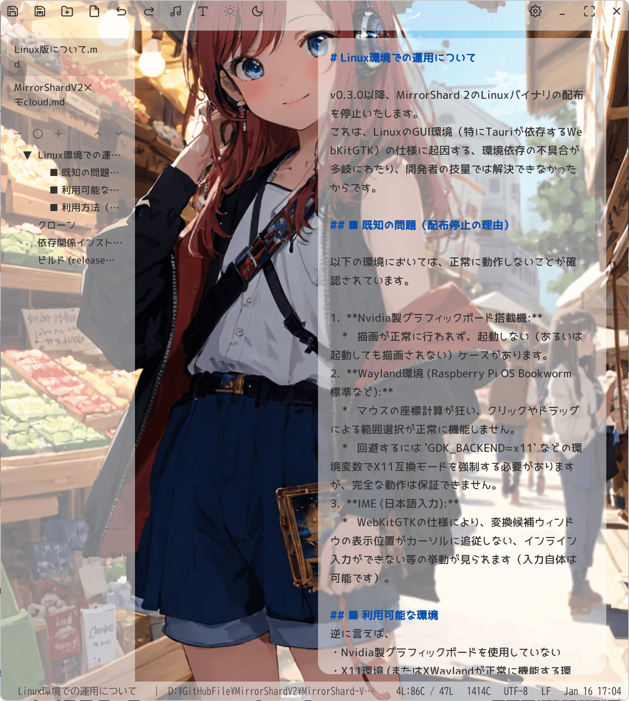

# MirrorShard 2 ver. 0.5.0 Beta  

創作支援用テキストエディタ「MirrorShard」のソフトウェアフレームワークをTauriに変更、高速化と軽量化を図ったものです。  
アイデアプロセッサ以外の機能はほぼ移植が完了していますので、創作用エディタとして、また巨大テキストファイルを扱えるアウトラインプロセッサとして、特に問題なく運用できるかと思います。  

## ダウンロード  

[]  
(https://github.com/DroicheadNua/MirrorShard_2/releases/download/v0.5.0/MirrorShard.2_0.5.0_x64_ja-JP.msi)  
[-green)]  
(https://github.com/DroicheadNua/MirrorShard_2/releases/download/v0.5.0/MirrorShard.2_0.5.0_aarch64.dmg)  

または、[最新のリリース一覧ページ](https://github.com/DroicheadNua/MirrorShard_2/releases/latest)からダウンロードできます。  
最下段の「Assets」の項目が折りたたまれている場合は、▶マークを押して展開してください。    

## 既知の問題 (Known Issues)  

現在、v0.5.0 Betaにおいて以下の問題が確認されています。  

### Windows版  
- ATOK 2017などの旧バージョンのATOKを使用している環境において、変換中のアンダーラインや文節区切りが表示されない現象が確認されています。  
  これはWebView2と旧来のIMEとの相性に起因するもので、Google日本語入力、Microsoft IMEでは正常に動作することを確認済みです。  
  （※最新のATOKサブスクリプション版での動作は未検証です）  

### Mac版  
- 広範囲を範囲選択したとき、選択範囲の表示が若干不自然になることがあります。また、Ctrl+Aでファイル全体が正しく選択できない場合があります。  

## トラブルの際には  
　インストールやご使用などにつきまして、何か疑問の点等ございましたら「FAQ.md」を御覧ください。  
　それでも解決しない問題がございましたら、MirrorShard開発アカウント
mirrorshard.dev@gmail.com
までご一報いただければ幸いです。  

## 主な特徴  
・ソフトウェアフレームワークにTauriを採用、起動の高速化と省メモリ化に成功  
・没入感を妨げないミニマルなデザインとフレームレスウィンドウ  
・数十万行に及ぶ巨大サイズのテキストにも対応  
・マークダウン記法によるアウトライン機能を搭載。アウトラインプロセッサとしても運用可能  
・AIチャット機能を搭載。Google Gemini（API使用）のほか、LM StudioやOllamaなどを介してローカルLLMとの連携も可能  

・安全なファイル保存機能（アトミックセーブ）を採用。停電やPCクラッシュなど、不測の事態にも強い設計  
　※ただし仕様上、「ファイル作成日＝ファイル更新日」になります。詳しくはFAQを御覧ください。  
・背景画像を活かせる半透明ウィンドウを実装。お好みで痛エディタも作成可能  

・UIを非表示にし、没入感を高める「ZEN」モードを搭載  
・縦書きプレビューウィンドウを実装。青空文庫形式のルビにも対応  
・PDF・HTML・EPUBでの出力、及びプリンタでの印刷に対応（※すべて横書きのみ）。  
・Geminiのログを読み込み可能。Geminiの膨大なログから必要な情報を検索・抽出するのに役立ちます  

## 前作（Electron版）からの変更点  
・フレームワークの変更により軽量化と高速化に成功。メモリ消費量も減少  
・ファイルサイズも大幅削減、前作のほぼ20分の1程度に  
・アイコンをSVG画像に変更、よりミニマルなデザインに  
・禁則処理やワードラップなど、ワープロとしての設定項目を強化  
・テキストエリアの幅や右寄せ・左寄せの設定が可能になり、半透明ウィンドウがより強力に  
・ファイル一覧とアウトラインペインを分離  
・軽量化のため添付音源と画像を各1種ずつに  
・フォントの同梱をやめ、フォントサイクルはシステムフォント（serif・sans-serif・monospace）を使用するように変更  
・縦書きウィンドウのリアルタイムプレビューを廃止（代わりに更新ボタンを設置）  
・エクスポート機能はPandocが不要に。ただし縦書きでの出力は不可に  
・プリンタでの印刷が可能に  
・ZENモード時、ツールバーへのマウスオーバーでUIボタンが表示される仕様に  
・AIチャット機能がOllamaにも対応  
・AIチャット機能で、起動時に前回終了時のログを読み込む仕様を廃止  
・アイデアプロセッサには未対応。最終的には既存の全機能を移植する予定  

## 操作方法  
詳しい操作方法については、[ユーザーマニュアル](docs/User_Manual.md)をご覧ください。  

## Linux版について  
Linux版はグラフィック環境由来（特にNvidia製グラフィックボード使用時やWayland環境）の不具合が多いため、バイナリの配布は停止しています。  
ただ、X11ベースの軽量環境（MX Linux, Zorin OS Lite等）においては、Electron版より軽快に動作することを確認しています。  
詳細な条件やビルド方法については [Linux版について](docs/Linux版について.md)をご覧ください。  

## エンコードについて  
　原則として、UTF-8 (BOMなし) での利用を強く推奨します。  

　本ソフトウェアが対応しているエンコードは、UTF-8とShift-JISのみとなっております。テキストファイルのエンコードを自動判別して読み込む仕様になっておりますが、特殊なエンコードの場合、判別に失敗することがあります。  
　読み込んだファイルが文字化けしている場合、そのまま保存してしまうと誤ったエンコードで保存されてしまい、ファイルの内容が失われてしまう場合があります。保存せずにタブを閉じてください。  
　エンコードの判別ができなかった場合は警告メッセージが表示されますが、稀ではあるものの、特殊な条件下では警告が出ないまま文字化けが発生することがございます。ご注意ください。  

　特殊なエンコードのファイルを本ソフトウェアで使用する場合、OS標準のメモアプリや他のエディタなどでUTF-8 (BOMなし) 形式に変換してからご利用ください。  

## 🎵 BGM機能とパフォーマンスについて  

本アプリケーションのBGM機能は、OSによって動作仕様とメモリ消費量が異なります。  

*   **Windows / macOS:**  
    *   設定画面から任意の音楽ファイル（mp3/wav/ogg）を指定して再生する場合、ストリーミング再生となるため**メモリ消費は最小限**に抑えられます。  
    *   デフォルトのBGMはアプリ内に埋め込まれているため、読み込み時に若干のCPU負荷がかかります。  
*   **Linux (Raspberry Pi含む):**  
    *   OSの制限により、音楽データをすべてメモリ上に展開して再生します。そのため、**BGM使用時はメモリ消費量が増加します。**  
    *   特にRaspberry Pi等の低スペック環境でメモリ不足を感じる場合は、BGMをオフにすることをお勧めします。  

## 使用素材  
・背景画像およびアイコン  
　Imagen 4 による生成  

・BGM  
　Pixabay https://pixabay.com より  
　・ambient piano "Candrika" -Moonlight-（leela_takaki様）  

　また、コードエディタモードの配色は[Tokyo Night](https://github.com/enkia/tokyo-night-vscode-theme) テーマをベースにしています。  

## ご利用にあたっての注意（免責事項）  
このソフトウェアはフリーウェアであり、無保証（AS IS）で提供されます。  
作者は、このソフトウェアの使用によって生じたいかなる損害（データの損失、逸失利益などを含むがこれに限らない）についても、一切の責任を負いません。  
開発には細心の注意を払っていますが、予期せぬ不具合が含まれている可能性があります。重要なデータを扱う際には、定期的にバックアップを取るようにしてください。  
このソフトウェアを利用した時点で、上記の免責事項に同意したものとみなします。  

## ライセンス  
　本ソフトウェアはMITライセンスのもとで公開されています。  

　本ソフトウェアはTauriで開発されました。エディタエンジンとしてCodeMirror 6 を採用しており、またオープンソースの小説用テキストエディタLeft  
（https://github.com/hundredrabbits/Left）
から多くの影響を受けています。特にアウトライン機能はLeftのソースコードを参考にしています。  

　なお、本ソフトウェアのコードの大半はGemini（2.5 proおよび3 pro preview）君が書いてくれました。ありがとうGemini君。  

　Copyright (c) 2025-2026 [DroicheadNua]  
　mirrorshard.dev@gmail.com  
　https://github.com/DroicheadNua/MirrorShard_2  
