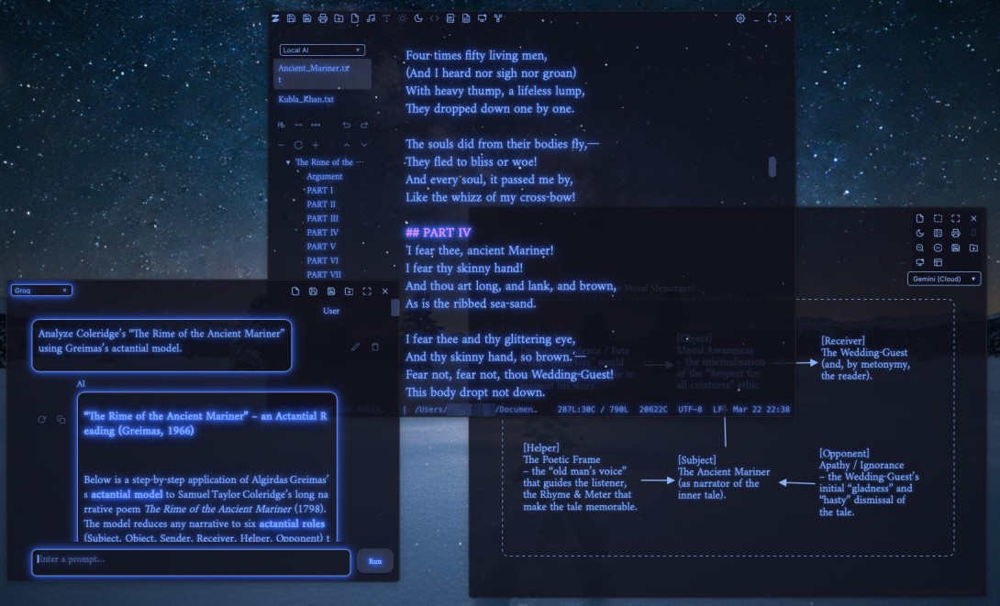
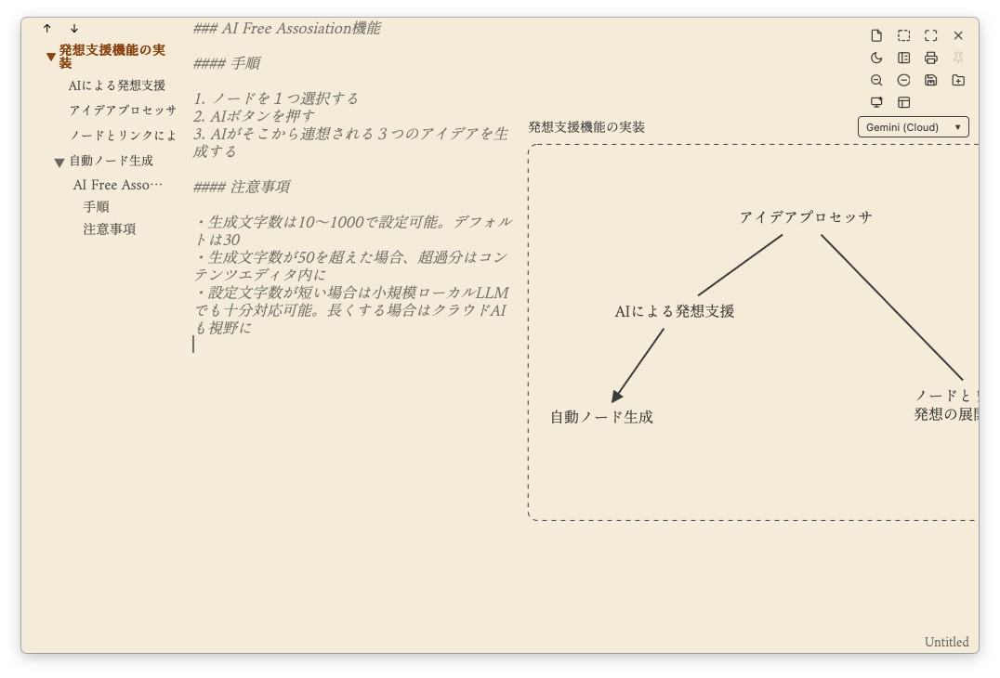
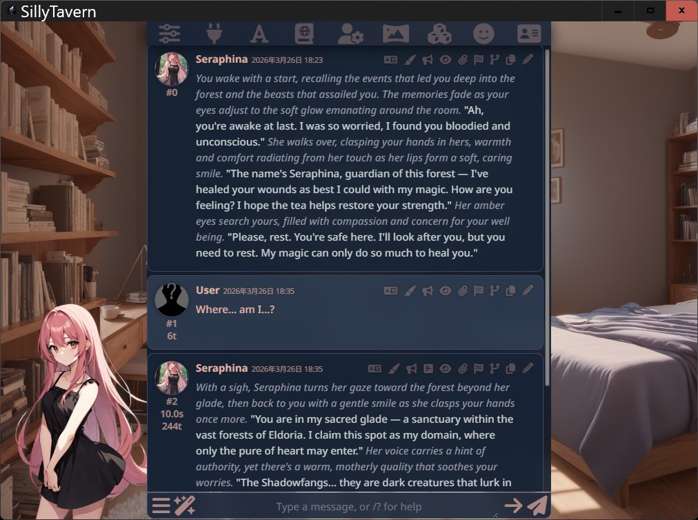
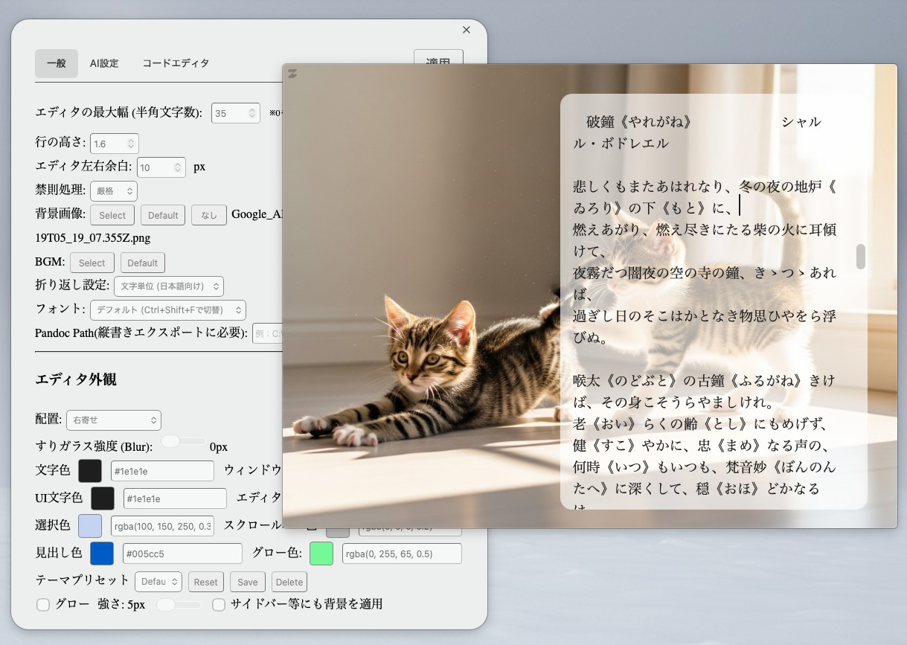

[日本語](README-ja.md) | **English**

# MirrorShard 2 ver. 1.6.0

MirrorShard 2 — An Open-Source AI-Powered Integrated Writing Environment (IWE)

MirrorShard 2 is a minimalist, highly immersive writing environment designed for modern creators. It is a daily-driveable, lightning-fast outliner that scales into a full-featured IWE. It unifies the entire creative process—from visual brainstorming and structured outlining to immersive drafting and character simulation—into a high-performance, Tauri-based workspace under 10MB.

*Note: A fully localized English version of the application and its documentation is planned for a future release in a separate repository. *

**[Official Website (Japanese)](https://droicheadnua.github.io/MirrorShard-Official/)**

## 📰 Media Coverage
Featured on **Mado no Mori (Impress Watch)** (Japanese):
* [Japanese Novel Editor "MirrorShard" reborn with "Tauri"! Lighter and Faster](https://forest.watch.impress.co.jp/docs/news/2091824.html)

## 💾 Downloads

  
  

Alternatively, download from the [Latest Release Page](https://github.com/DroicheadNua/MirrorShard_2/releases/latest).  
*(Expand the "Assets" section at the bottom to find the installer files).*

## ⚠️ Known Issues (v1.6.0)
*   **Windows**: When using older versions of ATOK (e.g., ATOK 2017), underlines and clause separators may not display during conversion. This is a known compatibility issue between WebView2 and legacy IMEs. (Google Japanese Input and Microsoft IME work flawlessly).
*   **Mac**: Selecting large areas using the scrollbar behaves erratically.

## 💡 Key Features
🎨 Ideation & Visual Brainstorming (Idea Processor)

Organize your chaotic thoughts on an infinite canvas. Perfect for Free-form Mind Mapping, Affinity Mapping, and non-linear brainstorming.

    AI Free Association: Spark three new ideas instantly from a single selected node.

    IP Missing Link: Select a link between two nodes and let AI bridge the gap with logical connections or dramatic plot points.

    Node Alchemy: Select multiple nodes and use AI as a catalyst to fuse them into a single, cohesive new concept.

    Story Archetypes: Rapidly build plots using proven templates like "Hero's Journey" or "Beat Sheet."

    Template Completion: AI understands the overall plot structure and your current progress to help draft scenes that fit the big picture.

    

🗂️ Information Management & Character Building

    Hierarchical Outliner: Powered by CodeMirror 6, it handles massive text files with hundreds of thousands of lines while keeping your structure organized via Markdown headers.

    SillyTavern Integration: Seamlessly launch the world-renowned character-interaction studio in a dedicated window (Ctrl+Shift+J). Perfect for testing character voices, personas, and managing complex lorebooks within your writing environment.

    

✍️ Immersive Drafting

Create your perfect writing sanctuary with a minimalist UI.

    ZEN Mode & Frameless Window: Discard the noise and face your manuscript.

    Atmospheric BGM & Typewriter Sounds: Enhance focus and immersion.

    Spotlight Mode: Dim the world around you, highlighting only the current paragraph.

    Integrated Editor AI: Continue writing from your cursor or use "Missing Link Completion" to fill gaps in your prose.

    Markdown & HTML Preview: A dedicated preview window for bloggers and web writers.

    Deep Customization: Fully adjustable color schemes, transparency, and background images. Make it your own unique writing space.

    

📦 Professional Exporting

Export your work in industry-standard formats.

    Rich Format Support: Print directly or export to PDF, DOCX (with Ruby support), HTML, and EPUB.

    Vertical Writing Preview: Native support for traditional Japanese vertical layouts with ruby.

🛠️ Coding & AI Agent Integration

    OpenCode AI Integration: Launch the OpenCode AI Coding Agent in a dedicated window (Ctrl+Shift+K) to help you customize the editor or manage scripts.

    Code Editor Mode: Includes syntax highlighting (HTML/CSS/JS/TS/Rust/Python/Markdown), AI code completion, and a built-in terminal.

    

⚙️ Miscellaneous

    Atomic Saving: Robust file saving designed to survive power outages or system crashes.

    Log Viewer: Import and analyze massive Gemini chat logs without freezing.

## 🎵 Materials Used  
*   **Background images and icons**: Generated by Imagen 4  
*   **BGM**: Generated by ACE-Step  
*   **Typewriter sounds**: Springin' (https://www.springin.org)  
*   **Tokyo Night Color Scheme**: Based on a design by Enkia (https://github.com/enkia/tokyo-night-vscode-theme).

## ⚖️ Important Notes (Disclaimer)  
This software is freeware and is provided “as is” without warranty.  
The author assumes no liability whatsoever for any damages (including, but not limited to, data loss or lost profits) arising from the use of this software.  
Although the software has been developed with the utmost care, it may contain unexpected bugs. Please make regular backups when handling important data.  
By using this software, you are deemed to have agreed to the above disclaimer.  

## License  
This software is released under the MIT License.  

This software was developed using Tauri. It uses CodeMirror 6 as its editor engine and draws heavily on the open-source novel-writing text editor Left  
https://github.com/hundredrabbits/Left  
. In particular, the outline feature was developed with reference to Left’s source code.  

---
Copyright (c) 2025-2026[DroicheadNua]  
mirrorshard.dev@gmail.com  
https://github.com/DroicheadNua/MirrorShard_2