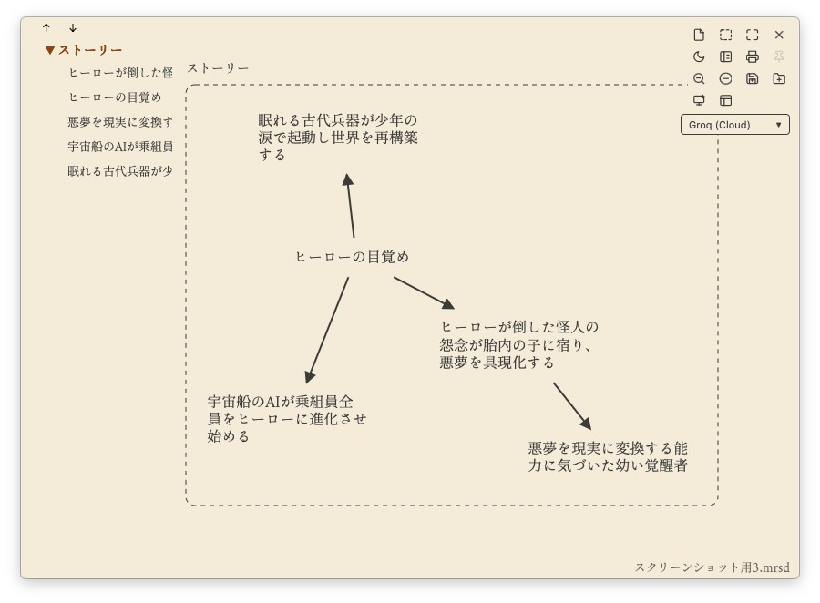
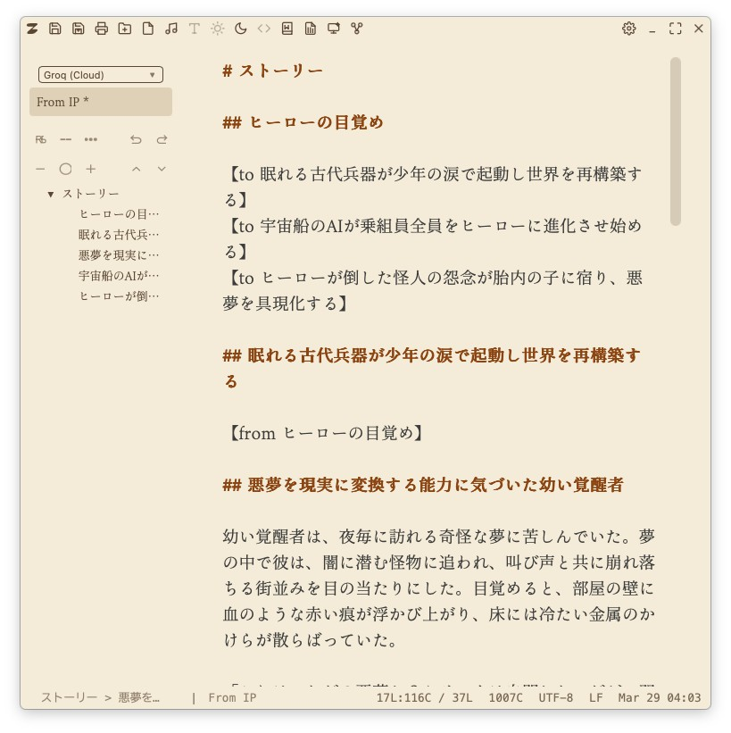
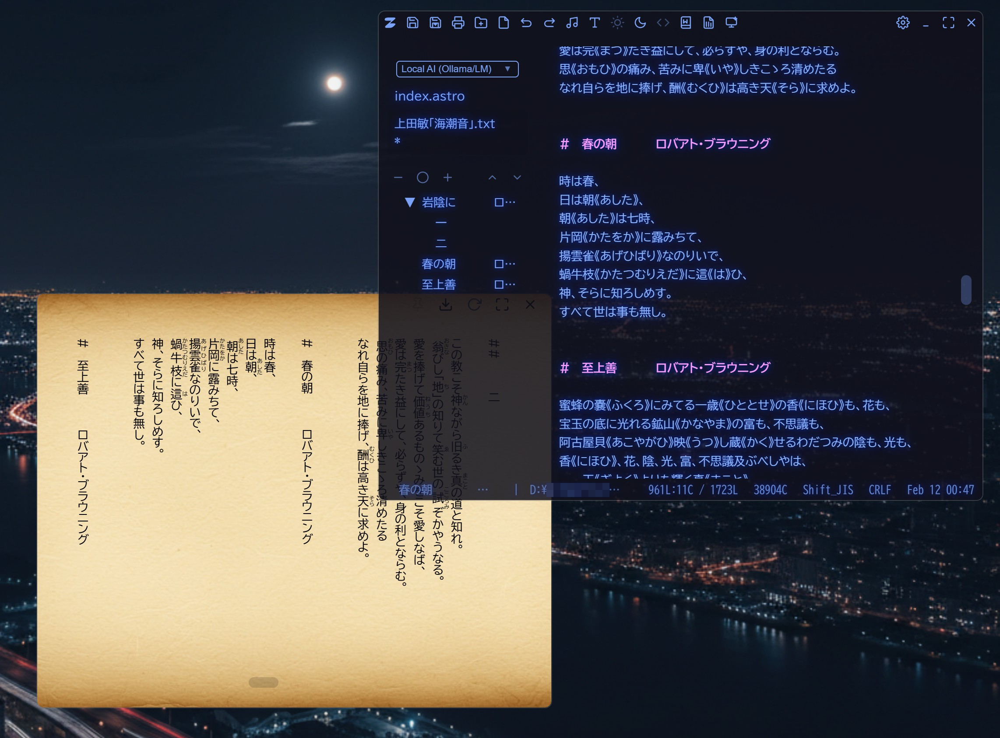

# 機能

MirrorShard 2は、アイデア生成から構造化、執筆までを一体化した統合執筆環境です。
特に「アイデアプロセッサ → エディタ」へのシームレスな変換に重点を置いて設計されています。

---

## 🧠 アイデアプロセッサ

ブレインストーミングやアイデアの展開を行うためのツールです。

### AI機能

* **AIによる自由連想 (AI Free Association)**
  選択したノードから3つの新しいアイデアを生成します。

* **ミッシングリンク (IP Missing Link)**
  2つのノード間の接続を選択すると、AIが論理的または物語的な橋渡しをして、その隙間を埋めてくれます。

* **ノードの融合 (Node Alchemy)**
  複数のノードを組み合わせて、新しい統一されたコンセプトを作り出します。

* **物語のテンプレート (Story Archetype)**
  「英雄の旅」や「ビートシート」などの構造化されたテンプレートを使用して物語を構築します。

* **テンプレートの補完 (Template Completion)**
  全体的な構造を維持しながら、AIが物語の展開を支援します。

---

## ✍️ 執筆環境

没入感のある執筆体験のために設計された、ミニマルでシンプルなエディタです。

* **Send to Editor**
  アイデアプロセッサから生成された構造をそのまま文章へと展開できます。

* **ZENモード & フレームレスウィンドウ**
  文章に集中するために、余計な画面表示を極力排除。

* **スポットライトモード**
  現在の段落のみをハイライト表示します。

* **AIライティング機能**
  カーソルの位置から執筆を続けたり、テキストの欠落部分を補完したりできます。

* **Markdown / HTML プレビュー**
  別のウィンドウでリアルタイムにプレビューできます。

* **詳細なカスタマイズ**
  色、レイアウト、透明度、背景画像をカスタマイズできます。

---

## 🗂️ 情報管理

* **階層型アウトライナー（Markdownベース）**
  構造化された見出しを使って、大規模な文書を管理します。

* **大容量ファイルのサポート**
  巨大なテキストファイルでも軽快に動作します。

* **SillyTavernとの連携**
  ロールプレイに特化したAIチャット「SillyTavern」を起動し、作成したキャラクターとの対話をすることができます。

---

## 📦 エクスポート

作成したファイルを複数の形式でエクスポートできます。

* PDF

* DOCX（ルビ対応）

* HTML

* EPUB

## 🇯🇵 日本語対応

* **縦書きプレビュー**
  日本語の縦書きレイアウトと、青空文庫形式のルビに対応しています。

  

---

## 🛠️ AI & コーディング

* **AIチャット連携**
  Google Gemini、Groq API、およびローカルLLMに対応しています。

* **OpenCode連携**
  別ウィンドウでコーディングエージェント「OpenCode」を起動できます。

* **コードエディタモード**
  構文強調表示、AIによるコード補完、簡易フォーマッタを実装しています。

* **内蔵ターミナル**
  別ウィンドウでターミナルを開き、開発やスクリプト実行を行えます。

---

## ⚙️ その他

* **アトミックセーブ**
  クラッシュ時でもデータが失われるのを防ぎます。

* **ログビューア**
  Google Geminiのログをテキストとして読み込み、大規模な会話履歴でも快適に閲覧・編集できます。

---

## 🌐 注意事項

* 現在のUIは日本語のみ対応しています。
* 今後のリリースで英語UIの対応を予定しています。
